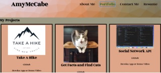
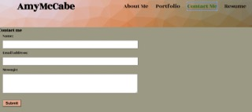
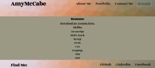

# Amy-McCabe-React, Personal Portfolio

## A Single Page Portfolio Application build with React that has sections for information about me, my projects, a contact form, and my resume. All code is my own.

## Table of Contents:
- [Published-Page](#published-page)
- [Screenshots](#screenshots)
- [Technologies](#technologies)
- [License](#license)
- [Contributing](#contributing)
- [Questions](#questions)
## Published-Page 
View the published GitHub page at: [mcamy2001.github.io/Amy-McCabe-React/](https://mcamy2001.github.io/Amy-McCabe-React/)
 

## Screenshots  

## Technologies

- [React](https://reactjs.org/)
- [JSX](https://reactjs.org/docs/introducing-jsx.html)
- Javascript
- CSS
- [Emailjs](https://www.emailjs.com/)

## License 
&copy; 2022 by Amy McCabe. 
This project is licensed under the MIT license.
https://opensource.org/licenses/MIT  
## Contributing 
Please submit a new issue or pull request. 
## Questions 
Contact me at: [mcca0168@umn.edu](mailto:mcca0168@umn.edu) or [GitHub](https://github.com/McAmy2001/)
